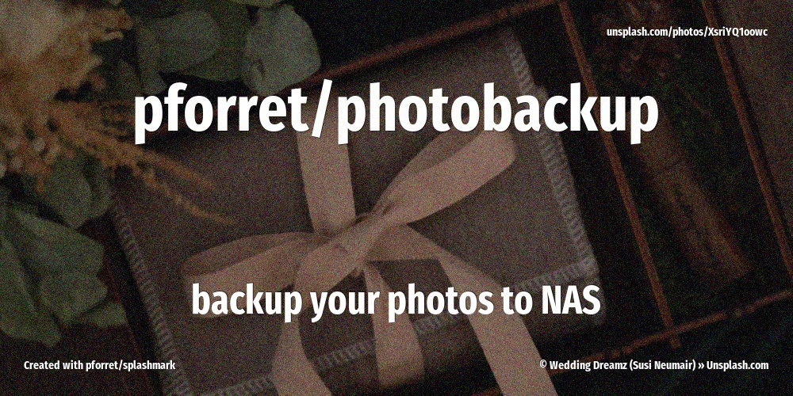

[](https://basher.gitparade.com/package/)

# photobackup



Backup photos to NAS

## 🔥 Usage
```
Program: photobackup 0.3.0 by peter@forret.com
Updated: Oct 26 11:08:56 2025
Description: Backup photos to NAS
Usage: photobackup [-h] [-q] [-v] [-f] [-l <log_dir>] [-t <tmp_dir>] [-s <source>] [-d <destin>] <action>
Flags, options and parameters:
    -h|--help        : [flag] show usage [default: off]
    -q|--quiet       : [flag] no output [default: off]
    -v|--verbose     : [flag] output more [default: off]
    -f|--force       : [flag] do not ask for confirmation (always yes) [default: off]
    -l|--log_dir <?> : [option] folder for log files   [default: /Users/pforret/log/photobackup]
    -t|--tmp_dir <?> : [option] folder for temp files  [default: /tmp/photobackup]
    -s|--source <?>  : [option] source folder
    -d|--destin <?>  : [option] destination folder
    <action>         : [parameter] action to perform: backup/check
```

```
Program : phackup.sh  by peter@forret.com
Version : v0.3.0 (Oct 26 12:42:19 2025)
Purpose : Photo backup script
Usage   : phackup.sh [-h] [-Q] [-V] [-f] [-L <LOG_DIR>] [-T <TMP_DIR>] [-S <SOURCE>] [-D <DESTIN>] <action>
Flags, options and parameters:
    -h|--help        : [flag] show usage [default: off]
    -Q|--QUIET       : [flag] no output [default: off]
    -V|--VERBOSE     : [flag] also show debug messages [default: off]
    -f|--FORCE       : [flag] do not ask for confirmation (always yes) [default: off]
    -L|--LOG_DIR <?> : [option] folder for log files   [default: log]
    -T|--TMP_DIR <?> : [option] folder for temp files  [default: tmp]
    -S|--SOURCE <?>  : [option] source folder
    -D|--DESTIN <?>  : [option] destination folder
    <action>         : [choice] action to perform  [options: backup,check,env,update]
```

## 🚀 Installation

with [basher](https://github.com/basherpm/basher)

	$ basher install pforret/photobackup

or with `git`

	$ git clone https://github.com/pforret/photobackup.git
	$ cd photobackup

## 📝 Acknowledgements

* script created with [bashew](https://github.com/pforret/bashew)

&copy; 2021 Peter Forret
